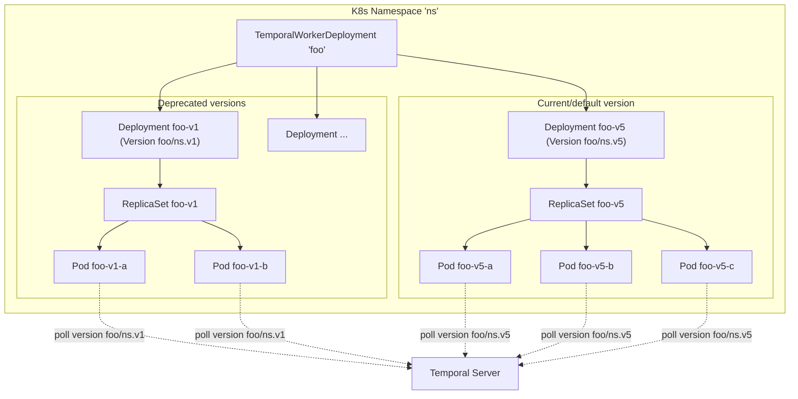
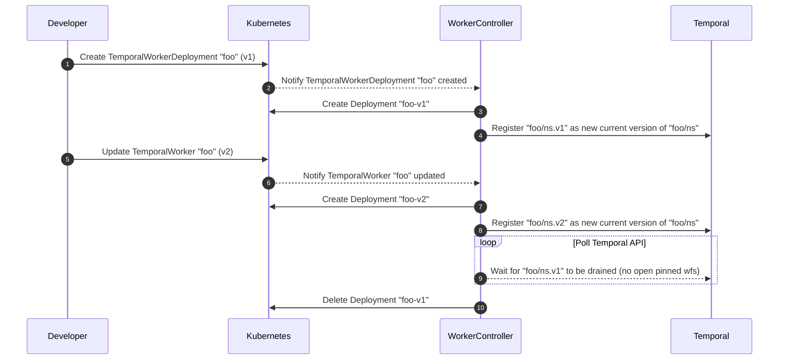

# Temporal Worker Controller

> ⚠️ This project is 100% experimental. Please do not attempt to install the controller in any production and/or shared environment.

The goal of the Temporal Worker Controller is to make it easy to run workers on Kubernetes while leveraging
[Worker Versioning](https://docs.temporal.io/workers#worker-versioning).

## Why

Temporal's [deterministic constraints](https://docs.temporal.io/workflows#deterministic-constraints) can cause headaches
when rolling out or rolling back workflow code changes.

The traditional approach to workflow determinism is to gate new behavior behind
[versioning checks](https://docs.temporal.io/workflows#workflow-versioning), otherwise known as the Patching API. Over time these checks can become a
source of technical debt, as safely removing them from a codebase is a careful process that often involves querying all
running workflows.

**Worker Versioning** is a Temporal feature that allows you to pin Workflows to individual versions of your workers, which 
are called **Worker Deployment Versions**. Using pinning, you’ll no longer need to patch most Workflows as part of routine 
deploys! With this guarantee, you can freely make changes that would have previously caused non-determinism errors had 
you done them without patching. And provided your Activities and Workflows are running in the same worker deployment version, 
you also do not need to ensure interface compatibility across versions.

This greatly simplifies Workflow upgrades, but the cost is that your deployment system must support multiple versions 
running simultaneously and allow you to control when they are sunsetted. This is typically known as a [rainbow deploy](https://release.com/blog/rainbow-deployment-why-and-how-to-do-it) 
(of which a **blue-green deploy** is a special case) and contrasts to a **rolling deploy** in which your Workers are upgraded in
place without the ability to keep old versions around.

This project aims to provide automation to enable rainbow deployments of your workers by simplifying the bookkeeping around 
tracking which versions still have active workflows, managing the lifecycle of versioned worker deployments, and calling 
Temporal APIs to update the routing config of Temporal Worker Deployments to route workflow traffic to new versions.

## Terminology
Note that in Temporal, **Worker Deployment** is sometimes referred to as **Deployment**, but since the controller makes
significant references to Kubernetes Deployment resource, within this repository we will stick to these terms:
- **Worker Deployment Version**: A version of a deployment or service. It can have multiple Workers, but they all run the same build. Sometimes shortened to "version" or "deployment version."
- **Worker Deployment**: A deployment or service across multiple versions. In a rainbow deploy, a worker deployment can have multiple active deployment versions running at once.
- **Deployment**: A Kubernetes Deployment resource. A Deployment is "versioned" if it is running versioned Temporal workers/pollers.

## Features

- [x] Registration of new Temporal Worker Deployment Versions
- [x] Creation of versioned Deployment resources (that manage the Pods that run your Temporal pollers)
- [x] Deletion of resources associated with drained Worker Deployment Versions
- [x] `Manual`, `AllAtOnce`, and `Progressive` rollouts of new versions
- [x] Ability to specify a "gate" workflow that must succeed on the new version before routing real traffic to that version
- [ ] Autoscaling of versioned Deployments
- [ ] Canary analysis of new worker versions
- [ ] Optional cancellation after timeout for workflows on old versions
- [ ] Passing `ContinueAsNew` signal to workflows on old versions


## Usage

In order to be compatible with this controller, workers need to be configured using these standard environment
variables:

- `TEMPORAL_HOST_PORT`: The host and port of the Temporal server, e.g. `default.foo.tmprl.cloud:7233`
- `TEMPORAL_NAMESPACE`: The Temporal namespace to connect to, e.g. `default`
- `TEMPORAL_DEPLOYMENT_NAME`: The name of the worker deployment. This must be unique to the worker deployment and should not
  change between versions.
- `WORKER_BUILD_ID`: The build ID of the worker. This should change with each new worker rollout.

Each of these will be automatically set by the controller, and must not be manually specified in the worker's pod template.

## How It Works

Note: These sequence diagrams have not been fully converted to versioning v0.31 terminology.

Every `TemporalWorkerDeployment` resource manages one or more standard `Deployment` resources. Each deployment manages pods
which in turn poll Temporal for tasks routed to their respective versions.



### Worker Lifecycle

When a new worker deployment version is deployed, the worker controller detects it and automatically begins the process
of making that version the new **current** (aka default) version of the worker deployment it is a part of. This could happen
immediately if `cutover.strategy = AllAtOnce`, or gradually if `cutover.strategy = Progressive`.

As older pinned workflows finish executing and deprecated deployment versions become drained, the worker controller also
frees up resources by sunsetting the `Deployment` resources polling those versions.

Here is an example of a progressive cut-over strategy gated on the success of the `HelloWorld` workflow:
```yaml
  cutover:
    strategy: Progressive
    steps:
      - rampPercentage: 1
        pauseDuration: 30s
      - rampPercentage: 10
        pauseDuration: 1m
    gate:
      workflowType: "HelloWorld"
```



## Contributing

This project is in very early stages; as such external code contributions are not yet being solicited.

Bug reports and feature requests are welcome! Please [file an issue](https://github.com/jlegrone/worker-controller/issues/new).

You may also reach out to `@jlegrone` on the [Temporal Slack](https://t.mp/slack) if you have questions, suggestions, or are
interested in making other contributions.
