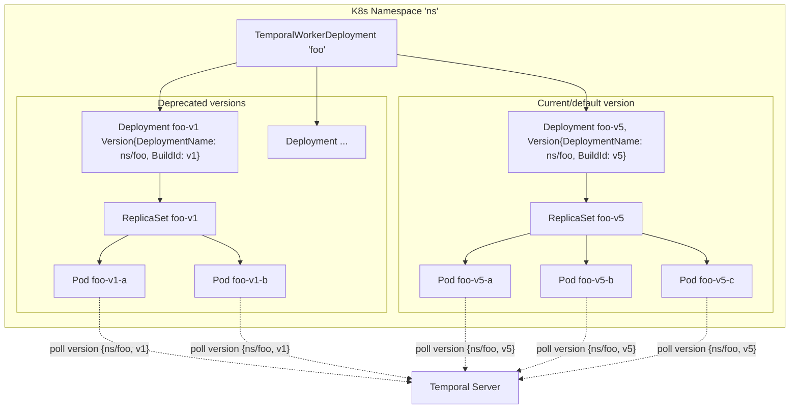
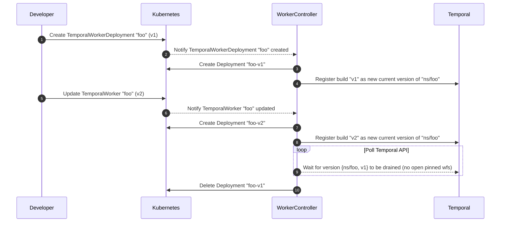

# Architecture

This document provides a detailed technical overview of how the Temporal Worker Controller works, including architecture diagrams, worker lifecycle management, and the relationship between Kubernetes resources and Temporal Worker Deployments.

> **Prerequisites**: This document assumes you've read the [Concepts Guide](concepts.md) first. The concepts document defines key terminology and relationships that are essential for understanding the architecture.

## How It Works

Every `TemporalWorkerDeployment` resource manages one or more standard `Deployment` resources. Each Deployment manages pods which in turn poll Temporal for tasks routed to their respective worker versions.



## Worker Lifecycle

When a new worker deployment version is deployed, the worker controller detects it and automatically begins the process of making that version the new **Current Version** of the worker deployment it is a part of. This could happen immediately if `rollout.strategy = AllAtOnce`, or gradually if `rollout.strategy = Progressive`.

As older pinned workflows finish executing and deprecated deployment versions become **Drained**, the worker controller frees up resources by scaling down and eventually deleting the `Deployment` resources running workers that poll those versions.

Here is an example of a progressive cut-over strategy gated on the success of the `HelloWorld` workflow:
```yaml
  rollout:
    strategy: Progressive
    steps:
      - rampPercentage: 1
        pauseDuration: 30s
      - rampPercentage: 10
        pauseDuration: 1m
    gate:
      workflowType: "HelloWorld"
```

### Gate Input Flow

When `spec.rollout.gate` is configured, the controller starts one test workflow per task queue in the Target Version. If gate input is provided, it is passed as the first workflow argument:

```yaml
rollout:
  gate:
    workflowType: "RolloutGate"
    # Inline JSON object
    input:
      thresholds:
        errorRate: 0.01
        p95LatencyMs: 250
    # Or reference ConfigMap/Secret (JSON document)
    # inputFrom:
    #   configMapKeyRef:
    #     name: my-gate-input
    #     key: payload.json
```

Input resolution happens in the controller before invoking the workflow. The payload must be a JSON object and is not logged, except for size and a short preview for debugging.

## Deployment Flow Diagram



## Resource Relationships

### TemporalWorkerDeployment (Custom Resource)
- **Purpose**: High-level configuration for a worker deployment across all versions
- **Manages**: Multiple Kubernetes `Deployment` resources (one per version)
- **Lifecycle**: Long-lived, persists across worker version changes

### Kubernetes Deployment (Managed by Controller)
- **Purpose**: Runs pods for a specific worker deployment version
- **Naming**: `{worker-deployment-name}-{build-id}`
- **Lifecycle**: Created when new version deployed, deleted when version drained

### TemporalConnection (Custom Resource)
- **Purpose**: Connection configuration to Temporal server(s)
- **Scope**: Can be shared across multiple worker deployments
- **Contains**: Server addresses, TLS configuration, authentication

## Version States and Rollout Strategies

For detailed information about version states (Current, Ramping, Deprecated, Drained) and rollout strategies (Manual, AllAtOnce, Progressive), see the [Concepts Guide](concepts.md).

For configuration examples and detailed rollout strategy options, see the [Configuration Reference](configuration.md).
