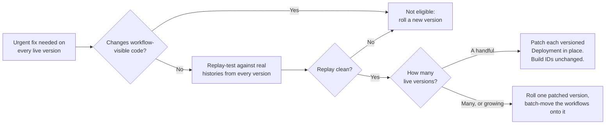
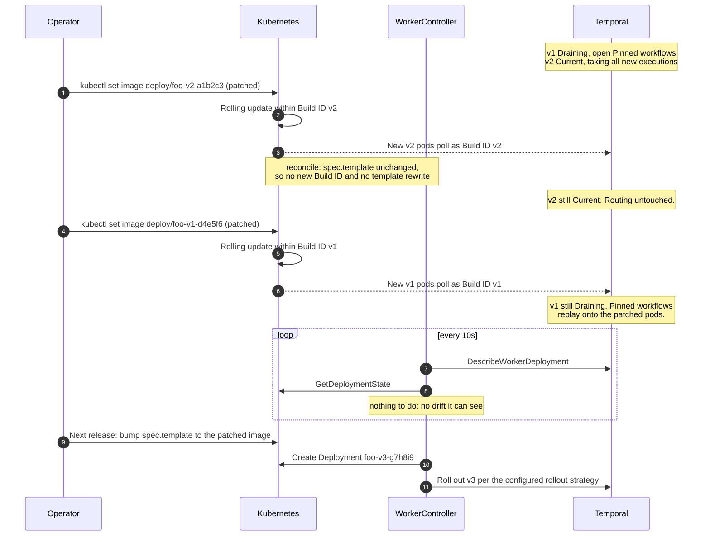

# Patching Live Worker Versions In Place

How to ship an urgent fix — a base-image CVE, a vulnerable OS library, a compromised sidecar — to
every worker version that is currently running, **without creating a new Worker Deployment Version**
and without disturbing Pinned workflows that are mid-execution.

The normal way to change a worker is to edit `spec.template` on the `WorkerDeployment` and let the
controller roll out a new version. That is the right answer almost always. It is the wrong answer
when you have Pinned workflows spread across several live versions and *all* of those versions need
the same fix: a new version fixes only new executions, leaves every draining version vulnerable for
as long as its workflows run, and adds another fleet to an already-crowded rainbow deployment.

This guide covers the other case. Read [concepts.md](concepts.md) first for the version-state
vocabulary (Current, Draining, Drained).

## Choose the approach first

In-place patching is an **imperative, O(live versions)** procedure. Every version needs its own replay
test, its own rolling update, and its own verification, and the result is a cluster that no longer
matches the CR. That is a good trade for a handful of versions during an incident, and a bad one as a
recurring chore across a large rainbow.

| Situation | Approach |
|---|---|
| The fix changes workflow-visible code | Not eligible — roll a new version the normal way |
| Up to ~10 live versions, urgent, fix is decision-identical | In-place patch — the rest of this guide |
| Decision-identical and you would rather consolidate | [Move the workflows, not the pods](#alternative-move-the-workflows-not-the-pods) |
| The version count itself is the problem | [Reduce the number of live versions](#reduce-the-number-of-live-versions) |

### The scale ceiling

Temporal caps a Worker Deployment at `matching.maxVersionsInDeployment` versions — **100** by default
on both Temporal Cloud and self-hosted, and the v1.28 release notes describe raising it beyond a few
hundred as unsafe. A namespace is capped at 100 Worker Deployments, and a version at 100 task queues
([Temporal Cloud system limits][cloud-limits]).

Check where you stand:

```bash
kubectl get workerdeployment <name> -o jsonpath='{.status.versionCount}{"\n"}'
```

Live versions — the ones this procedure touches — are a subset of that count: the target version, the
current version, and every `Draining` version that still has pods. If that subset is routinely in the
dozens, the answer is not a faster patch script. Two things are true at once:

- Each CVE cycle costs O(N) replay tests, rolling updates, and verifications, and base-image CVEs land
  on a monthly cadence.
- Every patched version diverges from `spec.template` until it drains, so a cluster rebuild or a
  restored backup silently reintroduces the vulnerability across all of them at once.

Bring the version count down first. The patch procedure then stays small enough to be safe.

## Scope: this is a pods-and-images procedure, not a code-change procedure

Everything below rests on one condition:

> The patched binary must make **byte-identical workflow decisions** to the binary it replaces.

Replacing the pods of a Build ID drops their in-flight workflow tasks and re-dispatches them to the
new pods, where Pinned workflows **replay their history from the beginning**. If the patch changes
what workflow code decides — command ordering, IDs, iteration, timers — replay fails with a
non-determinism error, and it fails worst on your longest-running executions, which have the most
history to replay.



Bumping the Temporal SDK is the **highest-risk** category of patch. SDKs work hard to preserve replay
compatibility, but regressions do reach releases, so an SDK bump should be patch-level at most and
must be replay-tested against histories from every live version rather than only the newest. Bumping a
JSON, time, or collections library that workflow code calls carries the same requirement. Base-image
CVEs (glibc, openssl, zlib), sidecar images, and dependencies reached only from activity code are the
straightforward cases — a sidecar-only change would still mint a new Build ID through the normal path,
because it alters `spec.template`, but it carries no replay risk at all.

The replay test is your only canary — you cannot canary within a Build ID, because a Build ID has one
routing identity by definition. Pull histories for the longest-running open executions on each live
version and run them through the SDK replayer against the patched binary before touching the cluster.

### In-flight activities restart too

Replacing pods drops in-flight **activity** tasks as well as workflow tasks. An activity whose worker
disappears runs again from the beginning once its start-to-close timeout expires or its heartbeat
lapses; it does not resume mid-execution unless it heartbeats and you resume from the heartbeat
details. This is independent of determinism — a decision-identical patch still restarts activities.
Before patching a fleet, confirm that long-running or non-idempotent activities either checkpoint via
heartbeat or tolerate a full re-run.

## Why in-place patching works

Two properties of the controller make this safe rather than a fight with the reconcile loop.

**The Build ID is derived from the CR, not from what is running.** `ComputeBuildID`
(`internal/k8s/deployments.go:125`) hashes `spec.template` on the `WorkerDeployment`; the image
*reference string* is an input to that hash, but the image *digest* is not. Each versioned Deployment
also carries its Build ID as the `TEMPORAL_WORKER_BUILD_ID` env var, written once at creation. Change
the image on a child Deployment and its new pods still register under the same Temporal version.

**The controller does not rewrite the pod template of existing Deployments.** Pod-template drift
detection returns immediately unless `unsafeCustomBuildID` is set
(`internal/planner/planner.go:562`) — with derived Build IDs it never runs at all. What the controller
does write:

| Path | Applies to | Touches the image? |
|---|---|---|
| `CreateDeployment` | the target version, only when it has no Deployment yet | builds from `spec.template` |
| `ScaleDeployments` | current, target, inactive, drained | no — uses the `scale` subresource |
| `DeleteDeployments` | `Drained` and `NotRegistered` versions only | n/a |
| pod-template drift | target version, **only if `unsafeCustomBuildID` is set** | rebuilds from `spec.template` |
| connection-spec drift | target and current versions | no — rewrites connection env vars and the mTLS mount only |

Deprecated versions (Draining, Drained) are never re-templated: `getUpdateDeployments`
(`internal/planner/planner.go:661`) only ever considers the target and current versions. And the
connection-drift path deliberately preserves each version's own image
(`internal/planner/planner.go:418`), so even a mid-incident certificate rotation will not clobber
your patch.

### Two garbage collectors, neither of which can take a Draining version

`getDeleteDeployments` (`internal/planner/planner.go:701`) deletes only `Drained` and `NotRegistered`
versions, and `NotRegistered` means Temporal has no record of the Build ID at all. Nor does the
controller ever scale a `Draining` version: `getScaleDeployments` has no case for that state, so its
replicas are left alone entirely.

Temporal's server runs its own collector. When a Worker Deployment is at `maxVersionsInDeployment` and
a new version tries to register, the server deletes the **oldest Drained version with no pollers in
the last five minutes**, scanning oldest to newest until it finds an eligible one. It cannot take a
`Draining` version — a version with open Pinned workflows stays Draining no matter how many pollers it
has — so this procedure is safe from it. See [Sunset and garbage collection][gc].

One edge worth knowing: a version that is already `Drained` but not yet deleted *is* eligible, and
restarting its pods opens a poller gap. Poller history lingers for `matching.PollerHistoryTTL` (five
minutes by default), so a normal rolling update finishes well inside the window — but a roll that
stalls past it can make the version collectable mid-patch. Drained versions have no Pinned workflows
left to protect, so skip them rather than patching them.

## The rollout



Routing never moves. No version is registered, promoted, drained, or deleted as a result of this
procedure — from Temporal's point of view each version simply replaced its pollers.

### 1. Identify the live versions

```bash
kubectl get deploy -l temporal.io/deployment-name -L temporal.io/build-id

kubectl get workerdeployment <name> \
  -o jsonpath='{.status.targetVersion.buildID}{"\t"}{.status.targetVersion.status}{"\n"}'

kubectl get workerdeployment <name> \
  -o jsonpath='{range .status.deprecatedVersions[*]}{.buildID}{"\t"}{.status}{"\n"}{end}'
```

Versions already scaled to zero (Drained, past `scaledownDelay`) need no patch — they have no running
pods and are on their way to deletion.

### 2. Patch the Current/target version first

It is taking all new executions, so it is the most exposed, and its workflows are the youngest if
anything does go wrong.

```bash
kubectl set image deployment/foo-v2-a1b2c3 worker=repo/worker:v2-patched
kubectl rollout status deployment/foo-v2-a1b2c3
```

Use a **new, distinct tag**. The child Deployment's image is not an input to the Build ID, so there is
no reason to reuse `:v2` and every reason not to — a mutable tag makes it impossible to tell later
which digest a given pod actually ran.

The version keeps live pollers throughout the roll with no extra configuration. The controller does
not set `spec.strategy` on versioned Deployments, so they use the Kubernetes default
(`maxUnavailable: 25%`, rounded down), which never takes the last pod down. `WorkerDeploymentSpec` has
no field for the rollout strategy, so if you want different behaviour you have to patch the child
Deployment directly — nothing in the controller rewrites `spec.strategy`, so the patch sticks, but
nothing restores it either if the Deployment is ever recreated.

### 3. Patch the draining versions

Only once the current version is healthy and its pollers are back:

```bash
kubectl set image deployment/foo-v1-d4e5f6 worker=repo/worker:v1-patched
kubectl rollout status deployment/foo-v1-d4e5f6
```

### 4. Verify

Per version, confirm the pollers came back under the same Build ID and that drainage state did not
move:

```bash
# drainage status must still be Draining, and the task queue list unchanged
temporal worker deployment describe-version \
  --deployment-name <k8s-namespace>/<workerdeployment-name> \
  --build-id v1-d4e5f6 --report-task-queue-stats

# pollers on the task queue should reappear under the same Build ID
temporal task-queue describe --task-queue <task-queue>

kubectl get workerdeployment <name> -o jsonpath='{.status.deprecatedVersions[*].status}{"\n"}'
```

Then watch for non-determinism on the replayed Pinned workflows — a spike in workflow task failures on
the patched version is the signal that the patch was not decision-identical after all. Rolling the
image back on that Deployment restores the previous binary; the workflows themselves are unharmed,
since a failing workflow task retries indefinitely rather than failing the execution.

## Patching more than a handful of versions

Enumerate rather than hand-listing. The CR status is the source of truth for which versions exist and
what state each is in:

```bash
kubectl get workerdeployment <name> -o json | jq -r '
  ([ .status.targetVersion, .status.currentVersion ] + (.status.deprecatedVersions // []))
  | map(select(. != null and .deployment != null))
  | unique_by(.deployment.name)
  | .[] | [.deployment.name, .buildID, .status] | @tsv'
```

Drive the patch off that list rather than typing Deployment names, and gate each step on the previous
one so a failure stops the sweep instead of cascading:

```bash
patch_one() {  # patch_one <deployment-name> <image>
  kubectl set image "deployment/$1" "worker=$2" &&
  kubectl rollout status "deployment/$1" --timeout=5m
}
```

Three things matter more as the count grows:

- **Pace it.** Every replaced pod makes its Pinned workflows replay full history from the beginning.
  Patching many versions at once turns that into a simultaneous replay storm across exactly the
  population with the longest histories. Go serially, or in small batches, and watch workflow task
  latency between batches.
- **Sample the replay tests properly.** One history per version is a thin sample. Pull the *longest*
  open histories on each version, since history length is what both replay cost and replay risk track.
- **Keep a drift ledger.** Record which Build ID is running which image tag. The CR will not tell you,
  and [closing the loop](#close-the-loop-afterwards) depends on knowing.

## Close the loop afterwards

Your CR now says `:v2` while the cluster runs `:v2-patched`. That drift is harmless in steady state
but has one sharp edge: anything that recreates the Deployment — someone deletes it, a cluster
rebuild, a restore — rebuilds it from `spec.template` and brings the vulnerability back.

Carry the patched image into `spec.template` as part of the next real version bump, so the next
version is not born vulnerable. Do not do it as a standalone edit during the incident unless you
actually want a new version rolled out.

Note that this only closes the loop for the *target* version. Every draining version you patched stays
divergent from any declarative source until it drains away, which is the main reason this technique
does not scale.

## Alternative: pin the Build ID and patch declaratively

If you would rather keep the CR authoritative for the target version, set `unsafeCustomBuildID` to
the Build ID that version already has, then change the image in `spec.template`. Drift is detected
via the `temporal.io/pod-template-spec-hash` annotation and applied as an in-place rolling update,
and the Build ID does not change.

```yaml
spec:
  workerOptions:
    unsafeCustomBuildID: v2-a1b2c3   # copied exactly from status.targetVersion.buildID
  template:
    spec:
      containers:
        - name: worker
          image: repo/worker:v2-patched
```

Five caveats, in descending order of how badly they bite:

1. **Unpin it as soon as the patch is out.** While it is set, the next change to real workflow code
   rides in under the *same* Build ID, and Pinned workflows will replay on incompatible code. This is
   the documented hazard of `unsafeCustomBuildID` and it is exactly what this procedure otherwise
   protects you from.
2. **Unpinning is itself a rollout.** Clearing the override sends `ComputeBuildID` back to hashing
   `spec.template`, which now contains the patched image, so the next reconcile creates a new version
   and rolls it out per your strategy. That is usually the outcome you want — it is how the patch
   becomes the baseline — but schedule it rather than discovering it.
3. **The value must match the existing Build ID exactly.** `ComputeBuildID` runs the override through
   `cleanBuildID` (everything outside `[a-zA-Z0-9-._]` is replaced, leading and trailing separators
   trimmed) and truncates to `MaxBuildIDLen`. A Build ID copied out of `status` round-trips because it
   came from the same function; a hand-written one may not. If cleaning leaves an empty string the
   override is silently discarded and the hash-based ID is used instead — minting the new version you
   were avoiding.
4. **It does nothing for deprecated versions.** Draining versions are never re-templated, so they
   still need the direct `kubectl set image` from step 3.
5. **Deployments predating the annotation are inert.** If the existing versioned Deployment has no
   `temporal.io/pod-template-spec-hash` annotation (created by an older controller), drift detection
   returns nil for backwards compatibility and nothing happens.

Mid-incident, the direct `kubectl set image` on every live version is the smaller-surface option.
Pinning is worth it when the patch is planned, GitOps must stay the source of truth, and you can
schedule the unpin.

## Alternative: move the workflows, not the pods

If the patched binary is decision-identical to the old one — the same condition this whole procedure
already requires — then the Pinned workflows on the old versions can replay on a patched *version*
just as safely as they can replay on patched pods of their own version. Temporal supports moving them
in bulk, which costs a fixed number of operator actions no matter how many versions you have.

Roll one patched version the normal way (edit `spec.template`, let the controller create and promote
it), then move each old version's workflows onto it:

```bash
temporal workflow update-options \
  --query="TemporalWorkerDeploymentVersion='$DEPLOYMENT:$OLD_BUILD_ID'" \
  --versioning-override-behavior pinned \
  --versioning-override-deployment-name "$DEPLOYMENT" \
  --versioning-override-build-id "$PATCHED_BUILD_ID"
```

This runs server-side as a batch job. Where in-place patching preserves every version indefinitely,
this *consolidates* them: the emptied-out old versions drain and sunset normally, so the version count
goes down instead of staying flat.

| | In-place patch | Move the workflows |
|---|---|---|
| Operator actions | one rolling update per live version | one batch job per source version, no pod changes |
| Replay-safety bar | identical | identical |
| Effect on version count | unchanged | old versions drain and sunset |
| CR/cluster drift | one per patched version | none — the patched version came from `spec.template` |
| Needs Temporal write access | no | yes |
| In-flight activities | restarted on every version | restarted only as workflows move |

Two caveats. The patched build must be replay-compatible with each source version's history *up to the
point each workflow has already reached* — the same replay test, run against the same histories. And
where it is not, `temporal workflow reset with-workflow-update-options` resets to a safe event and
applies the versioning override atomically.

This does **not** disturb the controller. `ManagerIdentity` guards routing changes on the Worker
Deployment (set current version, set ramping version); `update-options` writes per-execution
versioning overrides and leaves routing alone. See [Ownership](manager-identity.md).

The full procedure — identifying affected workflows with search attributes, choosing between an
override and a reset, handling drainage — is in Temporal's
[Recover pinned Workflows after a bad rollout][recover] runbook.

## Reduce the number of live versions

Everything above is downstream of one number. If patching live versions is a recurring chore, that
number is the thing to fix.

**Mark long-running workflow types AutoUpgrade.** A Pinned workflow keeps its version alive for its
entire lifetime, so a type that runs for weeks pins a version for weeks. Temporal's guidance is
direct: workflows that run longer than you are willing to keep a worker version alive should be
AutoUpgrade. The cost is that you take on [patching][patching] for those types — that is the real
trade, patch complexity against a rainbow you must CVE-patch indefinitely.

Existing executions can be migrated without touching pods:

```bash
temporal workflow update-options \
  --query="WorkflowType='$TYPE' AND TemporalWorkerDeploymentVersion='$DEPLOYMENT:$OLD_BUILD_ID'" \
  --versioning-override-behavior auto_upgrade
```

**Use Upgrade on Continue-as-New for entity-shaped workflows.** Each run stays pinned, but the
workflow adopts the target version at its next Continue-as-New boundary, so no version stays live
longer than a single run. This is the structural fix for entity workflows, AI agents with long sleeps,
and checkpointing batch processors. Public preview — see [Upgrade on Continue-as-New][upgrade-can].

**Tighten the sunset delays.** `scaledownDelay` and `deleteDelay` govern how long a drained version
keeps pods and how long its record lingers. Generous values are good for debugging and bad for version
count. See [Configuration](configuration.md#sunset-configuration).

**Watch the cap.** Hitting `maxVersionsInDeployment` wedges rollouts: the new version cannot register
and its pollers fail with `cannot add version ... since maximum number of versions have been
registered in the deployment`. There is an open server bug ([temporalio/temporal#10737][gc-bug]) where
at-cap reclamation fails to collect eligible drained versions; the workaround is deleting them by hand
with `temporal worker deployment delete-version`. Do that with the controller's identity, or hand
control back afterwards, or the controller drops into manual mode — see
[Ownership](manager-identity.md).

## Workflow Patching is still unavoidable

Two different things in this repository are called "patching." This document is about patching a
worker *image* in place. This section is about [Workflow Patching][patching] — the `patched()` /
`GetVersion` API that branches Workflow code so old histories keep replaying correctly. They solve
different problems and neither substitutes for the other.

The controller removes the *need* for Workflow Patching in the common case, and that is genuinely its
main selling point: a Pinned workflow never replays on new code, so a Pinned Workflow type can change
freely between versions with no branching in the source. That covers most changes for most teams.

It does not cover all of them. The obligation comes back in five situations, and the first is one this
document actively recommends.

### Where it is still required

1. **AutoUpgrade Workflow types.** By definition these move onto the target version mid-execution and
   replay their existing history against new code. Any change to the command sequence — adding,
   removing, or reordering Activities, timers, or child Workflows — needs a patch.
   [Reduce the number of live versions](#reduce-the-number-of-live-versions) recommends marking
   long-running types AutoUpgrade precisely to cap the version count; that recommendation *is* the
   decision to take on patching for those types. It is the trade, stated plainly.

2. **Moving Pinned workflows to another version.** The batch move in
   [Alternative: move the workflows, not the pods](#alternative-move-the-workflows-not-the-pods)
   lands executions on a build they did not start on. If that build's Workflow code differs in any
   command-producing way, it needs a patch so the target worker can replay the moved histories.

3. **Migrating Pinned to AutoUpgrade.** `update-options --versioning-override-behavior auto_upgrade`
   resumes the execution on its Worker Deployment's target version. If that differs from the version
   it was pinned to, patch first.

4. **While `unsafeCustomBuildID` is set.** Caveat 1 of the
   [pinned-Build-ID alternative](#alternative-pin-the-build-id-and-patch-declaratively) is exactly this
   hazard: workflow code changes ride in under the same Build ID, so Pinned workflows replay on new
   code. A patch is the only thing that makes that safe.

5. **Unversioned deployments.** During
   [migration to](migration-to-versioned.md) or [from](migration-to-unversioned.md) Worker Versioning,
   and in any namespace not using it, patching is the only versioning mechanism available. Temporal's
   guidance treats it as the fallback for environments that cannot adopt versioned worker deployments
   yet — not the default.

The one clean exception is [Upgrade on Continue-as-New][upgrade-can]: the version hop happens at a run
boundary, where history restarts, so nothing replays against unfamiliar code and no patch is needed.

### Patches have to ship before the change, not after

A patch can only branch on markers already in the history, so you cannot patch your way backwards.
This matters directly for rollbacks: [CD Rollouts](cd-rollouts.md) covers the automatic rollback
window, and rolling the current version back to an older Build ID sends AutoUpgrade workflows that
already advanced onto the new version back to code that has no branch for the newer behaviour. If the
change was version-incompatible and unpatched, the rollback is not patchable after the fact — reach
for [Reset-with-Move][recover] (`temporal workflow reset with-workflow-update-options`) instead.

Pinned workflows are unaffected by all of this, which is the point of pinning them.

### Finish the three-phase lifecycle

`patched()` / `deprecatePatch()` in TypeScript, Python, Ruby, and .NET; `workflow.GetVersion` in Go and
Java. The lifecycle is the same either way:

1. **Patch in.** Deploy both branches. New executions take the new path; replaying ones take the old.
2. **Deprecate.** Once no execution can still take the pre-patch path, drop the old branch and replace
   the call with `deprecatePatch()`, **in the same position in the command sequence**. Hoisting it to
   the top of the function is itself a non-determinism error.
3. **Remove.** Once no execution carries a non-deprecated marker for that ID, delete the call.

Find what is still live before advancing a phase:

```bash
temporal workflow list --query 'WorkflowType = "OrderWorkflow" AND TemporalChangeVersion = "add-fraud-check"'
temporal workflow list --query 'WorkflowType = "OrderWorkflow" AND TemporalChangeVersion IS NULL'
```

Finishing the lifecycle is not housekeeping. Patch markers accumulate in the `TemporalChangeVersion`
search attribute, which is capped at 2048 bytes; past that cap, markers stop landing in the attribute
and you lose the ability to query which patches are still required — exactly the information step 2
and step 3 depend on. Worker Versioning reduces how often you have to patch. It does not reduce the
cost of leaving patches unfinished.

### The controller cannot tell you when a patch is needed

Its job ends at routing and fleet lifecycle; it has no view into Workflow code. Whether a change needs
a patch is a source-level judgment, and the instrument for checking it is a replay test in CI against
real histories — the same instrument this document requires before an image patch.

## Known gap: no declarative base-image override

There is no way to tell the controller "change the image on every live version and keep the Build IDs
unchanged." That is the whole reason this document exists. Both routes above are workarounds: direct
`kubectl set image` is imperative and leaves the cluster diverged from the CR, and
`unsafeCustomBuildID` is declarative but reaches only the target version and is hazardous for as long
as it is set.

This is recorded here for future reference — there is no upstream issue for it as of this writing.

### Why it looks tractable

The controller already has all three pieces:

- It owns every versioned Deployment, including the draining ones.
- It already has an in-place update path that rewrites pod fields while **deliberately preserving each
  version's own image** — `updateDeploymentWithConnection` (`internal/planner/planner.go:418`).
- It already has the drift-detection idiom: hash a slice of desired state into a pod-template
  annotation and compare on the next reconcile — `ConnectionSpecHashAnnotation` and
  `PodTemplateSpecHashAnnotation` (`internal/k8s/deployments.go:44`).

So the shape is a new spec field — realistically a map of container name to image, since sidecars need
patching too — hashed into a third annotation and applied on that same update path.

### Why it is not a small change

1. **It cannot live in `spec.template`.** `ComputeBuildID` hashes `&w.Spec.Template` through
   `utils.ComputeHash` (`internal/controller/k8s.io/utils/utils.go:39`), so anything inside the pod
   template is a Build ID input by construction. The override has to be a sibling of `template` and
   must stay invisible to that hash. There is precedent for the placement — `minReadySeconds` and
   `progressDeadlineSeconds` are already siblings excluded from the Build ID — but not for the
   behaviour.

2. **It has to reach Draining versions, which the controller deliberately never touches.**
   `getUpdateDeployments` (`internal/planner/planner.go:661`) considers only the target and current
   versions, and `getScaleDeployments` has no `Draining` case at all. That restraint is load-bearing:
   it is exactly why in-place patching survives the reconcile loop today, as described in
   [Why in-place patching works](#why-in-place-patching-works). Widening it means the controller would
   restart pods under open Pinned workflows — triggering replay — as a routine reconcile action. This
   inverts the current safety property and is the main reason the feature is not a small change.

3. **The controller cannot verify the safety precondition.** The eligibility gate for this entire
   procedure — the patched binary makes byte-identical workflow decisions — is a human and CI judgment
   established by replay-testing real histories. No controller logic can establish it. The field
   therefore belongs to the same family as `unsafeCustomBuildID`: explicitly unsafe-named, or gated on
   an acknowledgement, and documented as operator-asserted.

4. **It has to be paced.** Applying an override across every draining version in one reconcile is the
   simultaneous replay storm described in
   [Patching more than a handful of versions](#patching-more-than-a-handful-of-versions). A real
   implementation would serialize — one version per reconcile, gated on the previous rollout going
   healthy — rather than fan out.

5. **New versions must be born patched while keeping an un-overridden Build ID.** If a rollout happens
   while an override is set, `CreateDeployment` has to apply the override to the new Deployment's pod
   spec while `ComputeBuildID` still hashes the un-overridden template. Get this wrong in either
   direction and you land on one of the two failure modes the feature exists to avoid: a new version
   born vulnerable, or setting the override minting a version.

6. **Removal semantics need deciding.** Clearing the override must not silently roll every live version
   back to its vulnerable image. It most likely has to be a one-way patch — a no-op on existing
   Deployments — with `spec.template` catching up at the next real version bump, per
   [Close the loop afterwards](#close-the-loop-afterwards).

### What it would and would not fix

It would fix the drift problem: the CR becomes authoritative again, so cluster rebuilds and restores
reproduce patched pods instead of vulnerable ones, and the O(N) *operator* actions collapse to a single
edit.

It would not fix the O(N) *pod restarts* or their replay cost, and it would not reduce the version
count. [Reducing the number of live versions](#reduce-the-number-of-live-versions) stays the
higher-leverage move.

## Related

- [Concepts](concepts.md) — version states, Pinned vs AutoUpgrade, `unsafeCustomBuildID`
- [Configuration](configuration.md) — sunset delays that govern how long a draining version lives
- [CD Rollouts](cd-rollouts.md) — the normal path, and the automatic 1-hour rollback window
- [Ownership](manager-identity.md) — why routing changes made by hand make the controller back off
- [Limits](limits.md) — naming and length constraints on controller-generated resources
- [Recover pinned Workflows after a bad rollout][recover] — Temporal's batch-recovery runbook
- [Moving a pinned Workflow][move-pinned] — the `update-options` reference
- [Workflow Patching][patching] — the `patched()` / `GetVersion` API and its three-phase lifecycle
- [Upgrade on Continue-as-New][upgrade-can] — capping how long a version stays live
- [Sunset and garbage collection][gc] — how the server reclaims versions

[cloud-limits]: https://docs.temporal.io/cloud/limits#worker-versioning-level
[gc]: https://docs.temporal.io/production-deployment/worker-deployments/worker-versioning/sunset-and-gc#garbage-collection
[gc-bug]: https://github.com/temporalio/temporal/issues/10737
[move-pinned]: https://docs.temporal.io/production-deployment/worker-deployments/worker-versioning/roll-out-and-pin#moving-a-pinned-workflow
[patching]: https://docs.temporal.io/patching
[recover]: https://docs.temporal.io/production-deployment/worker-deployments/recover-pinned-workflows
[upgrade-can]: https://docs.temporal.io/production-deployment/worker-deployments/worker-versioning/upgrade-on-continue-as-new
