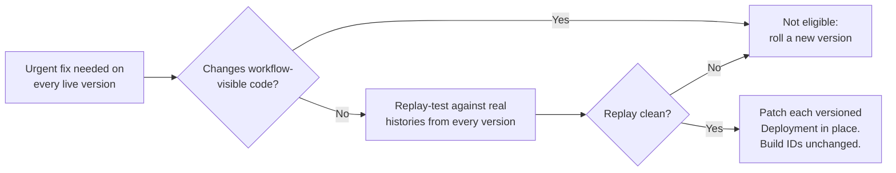
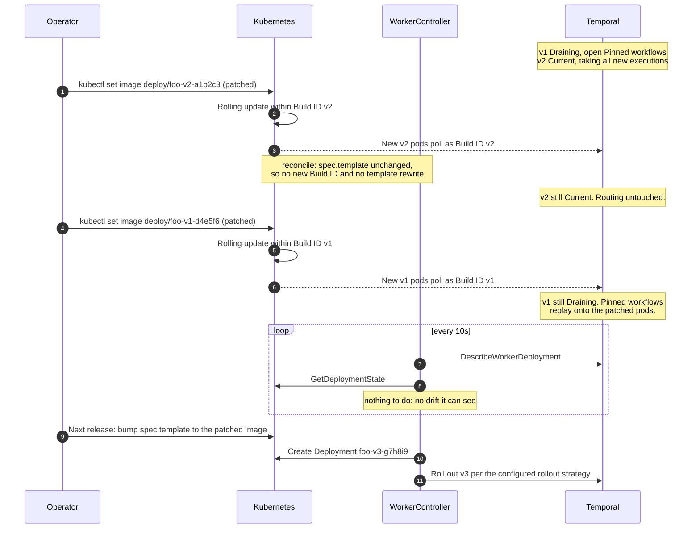

# Patching Live Worker Versions In Place

How to ship an urgent fix — a base-image CVE, a vulnerable OS library, a compromised sidecar — to
every worker version that is currently running, **without creating a new Worker Deployment Version**
and without disturbing Pinned workflows that are mid-execution.

The normal way to change a worker is to edit `spec.template` on the `WorkerDeployment` and let the
controller roll out a new version. That is the right answer almost always. It is the wrong answer
when you have Pinned workflows spread across several live versions and *all* of those versions need
the same fix: a new version fixes only new executions, leaves every draining version vulnerable for
as long as its workflows run, and adds another fleet to an already-crowded rainbow deployment.

This guide covers the other case. Read [concepts.md](concepts.md) first for the version-state
vocabulary (Current, Draining, Drained).

## Scope: this is a pods-and-images procedure, not a code-change procedure

Everything below rests on one condition:

> The patched binary must make **byte-identical workflow decisions** to the binary it replaces.

Replacing the pods of a Build ID drops their in-flight workflow tasks and re-dispatches them to the
new pods, where Pinned workflows **replay their history from the beginning**. If the patch changes
what workflow code decides — command ordering, IDs, iteration, timers — replay fails with a
non-determinism error, and it fails worst on your longest-running executions, which have the most
history to replay.



Bumping the Temporal SDK is **not** a safe patch under this rule, even for a security release. Neither
is bumping a JSON, time, or collections library that workflow code calls. Base-image CVEs (glibc,
openssl, zlib), sidecar images, and dependencies reached only from activity code are the safe cases.

The replay test is your only canary — you cannot canary within a Build ID, because a Build ID has one
routing identity by definition. Pull histories for the oldest open execution on each live version and
run them through the SDK replayer against the patched binary before touching the cluster.

## Why in-place patching works

Two properties of the controller make this safe rather than a fight with the reconcile loop.

**The Build ID is derived from the CR, not from what is running.** `ComputeBuildID`
(`internal/k8s/deployments.go:125`) hashes `spec.template` on the `WorkerDeployment`; the image
*reference string* is an input to that hash, but the image *digest* is not. Each versioned Deployment
also carries its Build ID as the `TEMPORAL_WORKER_BUILD_ID` env var, written once at creation. Change
the image on a child Deployment and its new pods still register under the same Temporal version.

**The controller does not rewrite the pod template of existing Deployments.** Pod-template drift
detection returns immediately unless `unsafeCustomBuildID` is set
(`internal/planner/planner.go:562`) — with derived Build IDs it never runs at all. What the controller
does write:

| Path | Applies to | Touches the image? |
|---|---|---|
| `CreateDeployment` | the target version, only when it has no Deployment yet | builds from `spec.template` |
| `ScaleDeployments` | current, target, inactive, drained | no — uses the `scale` subresource |
| `DeleteDeployments` | `Drained` and `NotRegistered` versions only | n/a |
| pod-template drift | target version, **only if `unsafeCustomBuildID` is set** | rebuilds from `spec.template` |
| connection-spec drift | target and current versions | no — rewrites connection env vars and the mTLS mount only |

Deprecated versions (Draining, Drained) are never re-templated: `getUpdateDeployments`
(`internal/planner/planner.go:661`) only ever considers the target and current versions. And the
connection-drift path deliberately preserves each version's own image
(`internal/planner/planner.go:418`), so even a mid-incident certificate rotation will not clobber
your patch.

A `Draining` version also cannot be garbage-collected out from under you. `getDeleteDeployments`
(`internal/planner/planner.go:701`) deletes only `Drained` and `NotRegistered` versions, and
`NotRegistered` means Temporal has no record of the Build ID at all — a version with open Pinned
workflows stays in Temporal's version list as Draining no matter how many pollers it has, so
restarting its pods cannot trip that path.

## The rollout



Routing never moves. No version is registered, promoted, drained, or deleted as a result of this
procedure — from Temporal's point of view each version simply replaced its pollers.

### 1. Identify the live versions

```bash
kubectl get deploy -l temporal.io/deployment-name -L temporal.io/build-id

kubectl get workerdeployment <name> \
  -o jsonpath='{.status.targetVersion.buildID}{"\t"}{.status.targetVersion.status}{"\n"}'

kubectl get workerdeployment <name> \
  -o jsonpath='{range .status.deprecatedVersions[*]}{.buildID}{"\t"}{.status}{"\n"}{end}'
```

Versions already scaled to zero (Drained, past `scaledownDelay`) need no patch — they have no running
pods and are on their way to deletion.

### 2. Patch the Current/target version first

It is taking all new executions, so it is the most exposed, and its workflows are the youngest if
anything does go wrong.

```bash
kubectl set image deployment/foo-v2-a1b2c3 worker=repo/worker:v2-patched
kubectl rollout status deployment/foo-v2-a1b2c3
```

Use a **new, distinct tag**. The child Deployment's image is not an input to the Build ID, so there is
no reason to reuse `:v2` and every reason not to — a mutable tag makes it impossible to tell later
which digest a given pod actually ran.

Set `maxUnavailable: 0` on the versioned Deployment (or make sure surge is available) so the version
always keeps live pollers through the roll.

### 3. Patch the draining versions

Only once the current version is healthy and its pollers are back:

```bash
kubectl set image deployment/foo-v1-d4e5f6 worker=repo/worker:v1-patched
kubectl rollout status deployment/foo-v1-d4e5f6
```

### 4. Verify

Per version, confirm the pollers came back under the same Build ID and that drainage state did not
move:

```bash
# drainage status must still be Draining, and the task queue list unchanged
temporal worker deployment describe-version \
  --deployment-name <k8s-namespace>/<workerdeployment-name> \
  --build-id v1-d4e5f6 --report-task-queue-stats

# pollers on the task queue should reappear under the same Build ID
temporal task-queue describe --task-queue <task-queue>

kubectl get workerdeployment <name> -o jsonpath='{.status.deprecatedVersions[*].status}{"\n"}'
```

Then watch for non-determinism on the replayed Pinned workflows — a spike in workflow task failures on
the patched version is the signal that the patch was not decision-identical after all. Rolling the
image back on that Deployment restores the previous binary; the workflows themselves are unharmed,
since a failing workflow task retries indefinitely rather than failing the execution.

## Close the loop afterwards

Your CR now says `:v2` while the cluster runs `:v2-patched`. That drift is harmless in steady state
but has one sharp edge: anything that recreates the Deployment — someone deletes it, a cluster
rebuild, a restore — rebuilds it from `spec.template` and brings the vulnerability back.

Carry the patched image into `spec.template` as part of the next real version bump, so the next
version is not born vulnerable. Do not do it as a standalone edit during the incident unless you
actually want a new version rolled out.

## Alternative: pin the Build ID and patch declaratively

If you would rather keep the CR authoritative for the target version, set `unsafeCustomBuildID` to
the Build ID that version already has, then change the image in `spec.template`. Drift is detected
via the `temporal.io/pod-template-spec-hash` annotation and applied as an in-place rolling update,
and the Build ID does not change.

```yaml
spec:
  workerOptions:
    unsafeCustomBuildID: v2-a1b2c3   # copied verbatim from status.targetVersion.buildID
  template:
    spec:
      containers:
        - name: worker
          image: repo/worker:v2-patched
```

Four caveats, in descending order of how badly they bite:

1. **Unpin it as soon as the patch is out.** While it is set, the next change to real workflow code
   rides in under the *same* Build ID, and Pinned workflows will replay on incompatible code. This is
   the documented hazard of `unsafeCustomBuildID` and it is exactly what this procedure otherwise
   protects you from.
2. **The value must match the existing Build ID character for character.** `ComputeBuildID` returns
   the override verbatim, so a typo or a truncated copy mints a new version — the outcome you were
   avoiding.
3. **It does nothing for deprecated versions.** Draining versions are never re-templated, so they
   still need the direct `kubectl set image` from step 3.
4. **Deployments predating the annotation are inert.** If the existing versioned Deployment has no
   `temporal.io/pod-template-spec-hash` annotation (created by an older controller), drift detection
   returns nil for backwards compatibility and nothing happens.

Mid-incident, the direct `kubectl set image` on every live version is the smaller-surface option.
Pinning is worth it when the patch is planned, GitOps must stay the source of truth, and you can
schedule the unpin.

## Related

- [Concepts](concepts.md) — version states, Pinned vs AutoUpgrade, `unsafeCustomBuildID`
- [Configuration](configuration.md) — sunset delays that govern how long a draining version lives
- [CD Rollouts](cd-rollouts.md) — the normal path, and the automatic 1-hour rollback window
- [Ownership](manager-identity.md) — why routing changes made by hand make the controller back off
